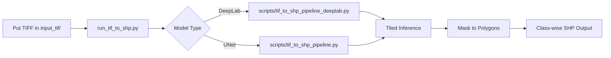
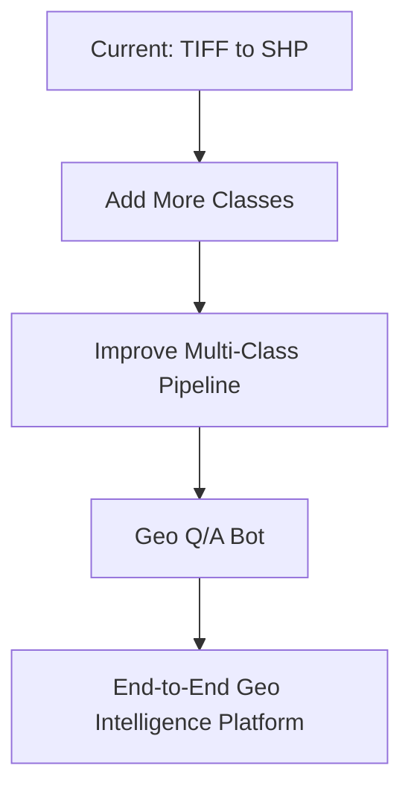

# Akshit GeoIntell IIT Tirupati

A practical GeoAI pipeline to convert orthomosaic **TIFF** imagery into class-wise **Shapefiles (SHP)**.

This project started as a hands-on learning journey: training segmentation models, debugging noisy predictions, handling huge rasters safely, and finally building a drop-in pipeline where a user can just place TIFF files and run one command.

---

## What this project does

- Takes large geospatial TIFF images as input
- Runs tiled semantic segmentation (UNet or DeepLab)
- Converts predicted masks into polygons
- Exports class-wise shapefiles (Built-up, Road, Water body, optional Farm)

---

## Project flow



---

## Important files

- `run_tif_to_shp.py` → one-command runner for batch TIFF to SHP
- `scripts/tif_to_shp_pipeline_deeplab.py` → main DeepLab inference pipeline
- `scripts/tif_to_shp_pipeline.py` → UNet inference pipeline
- `train3.py` → UNet training script
- `train4.1.py` → DeepLab training/experimentation script
- `notebooks/quickstart_visualization.ipynb` → clean demo notebook
- `visualize3.ipynb` and `visualize_results.ipynb` → additional analysis notebooks

---

## Quick start (drop TIFF and run)

### 1) Install dependencies

```bash
pip install -r requirements.txt
```

### 2) Put your TIFF file(s)

Place `.tif` / `.tiff` files in:

```text
input_tif/
```

### 3) Run pipeline (default: DeepLab)

```bash
python run_tif_to_shp.py
```

Outputs are generated in:

```text
outputs/<tif_name>_shp/
```

---

## Useful commands

### Run with UNet

```bash
python run_tif_to_shp.py --model-type unet --checkpoint unet_best_v4.pth
```

### Include Farm class also

```bash
python run_tif_to_shp.py --include-farm
```

### Force CPU

```bash
python run_tif_to_shp.py --device cpu
```

---

## Learning highlights (human side)

This project taught me that real-world GeoAI is not just model accuracy:

- **Memory safety matters**: full-scene masks can crash RAM on large orthos, so tiled streaming is essential.
- **Preprocessing consistency matters**: mismatch between training and inference can create checkerboard artifacts.
- **Post-processing matters**: dissolving/cleaning polygons improves map usability a lot.
- **Usability matters**: a good pipeline should be runnable by someone who did not train the model.

---

## Model files

Model checkpoints are shared through Google Drive (both .pth files):

- https://drive.google.com/drive/folders/1VQmLG7FAc4ikkmuw1RXm7u2Kxh5EmFms?usp=drive_link

Download the models and place them in the project root folder:

- unet_best_v4.pth
- deeplab_best_v4.pth

Reason: these files are larger than GitHub’s 100 MB single-file limit.

---

## Output classes

Default exported classes:

- 1 → Built_Up_Area_typ
- 2 → Road
- 3 → Water_Body

Optional:

- 4 → Farm

---

## End goal

Make geospatial extraction practical: **drop TIFF → run pipeline → get SHP ready for GIS tools**.

---

## Work in progress

The next phase of this project is focused on expanding capability and making the system production-friendly.

### 1) New classes to detect

- Railway lines
- Bridges
- House roofs

### 2) Stronger unified pipeline

- Better multi-class training setup for additional categories
- Improved post-processing for cleaner and more connected polygons
- More robust handling for large TIFF scenes and varied image quality
- Better configuration support so users can select model/class profiles easily

### 3) Geo Q/A assistant (ongoing)

- A question-answering bot for geospatial outputs and project usage help
- Planned support for questions like:
    - Which classes were detected in this area?
    - How to run the pipeline for a new district?
    - Which model should I use for my use case?


